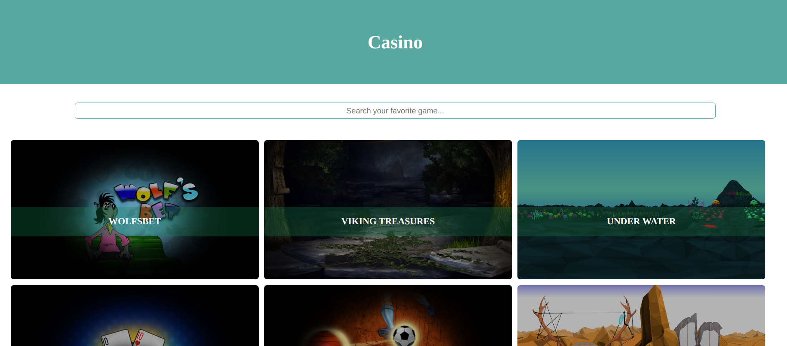

# Casino

This project was generated with [Angular CLI](https://github.com/angular/angular-cli) version 8.3.20.
Folder structure, and naming convention are according to Angular Style Guide.

Things that should be integrated if this was bigger project: 
- Implement lazy loading, if multiple routes and modules
- Dynamic route for every game, if single game should be displayed
- Take JSON with HTTP if is outside of the project folders
- Cashed search functionality with key:value
- Fully tested with code coverage
- Add logger functionality, log errors in file

## Development server

Run `ng serve` for a dev server. Navigate to `http://localhost:4200/`. The app will automatically reload if you change any of the source files.

## Build

Run `ng build` to build the project on client side. The build artifacts will be stored in the `dist/` directory. Use the `--prod` flag for a production build.

## Build SSR

Run `build:ssr` to build the project on server side. The build artifacts will be stored in the `dist/server` directory.

## Run SSR
Run `serve:ssr` to run express server. Navigate to `http://localhost:4000/` to check the site.

## Running unit tests

Run `ng test` to execute the unit tests via [Karma](https://karma-runner.github.io).

## Site preview

